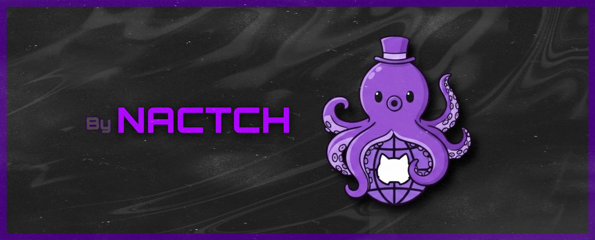

  
  

# Hi 👋, I'm Nactch

### A collection of open-source tools and experiments

## 🚀 About Me

I’m a developer and cybersecurity enthusiast.  
I enjoy working on projects related to ethical hacking, automation, and secure coding practices.  
I’m driven by curiosity and the challenge of making systems more resilient and trustworthy.

## 📚 Learning & Knowledge

- 🌱 I'm currently learning **more about cyber security**

## 🚀 Projects

| Project | Description | Links |
|---|---|---|
| Web Raccoon  | Web Raccoon — A powerful web reconnaissance toolkit for DNS lookup, subdomain enumeration, WHOIS info, open ports scanning, and TLS certificate analysis.  | [GitHub](https://github.com/nacttch/web-raccoon) |

### Web Raccoon 

**Technologies Used:** python

## 🌐 Connect with Me

&nbsp;&nbsp;&nbsp;&nbsp;&nbsp;&nbsp;

## 🛠️ Skills & Technologies

### 💻 Programming Languages

&nbsp;&nbsp;&nbsp;

### 💻 DevOps

### 💻 Game Engines

### 💻 Other

---

### 🎯 "Code is like humor. When you have to explain it, it's bad." – Cory House

**Thank you for visiting my profile! 😊**

